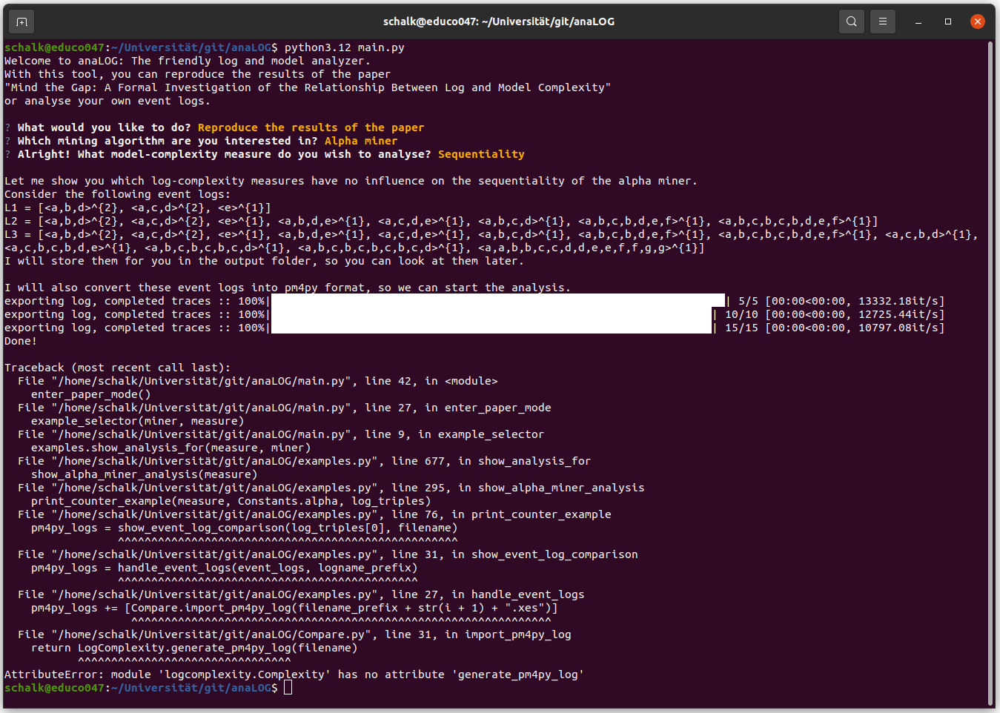

# anaLOG: The friendly log and model analyzer #
This project accompanies the paper *Mind the Gap: A Formal Investigation of the Relationship Between Log and Model Complexity*, available at (https://doi.org/10.48550/arXiv.2505.23233).
With this tool, you can reproduce the results of the paper.
In later versions, it will also be possible to analyze your own event logs.


## Installation ##
1. Ensure that you have *Python 3.12* or later installed.
2. Clone the project to your local files.
3. Go to (https://github.com/MaxVidgof/process-complexity) and download the file *Complexity.py* from this repository.
4. (Optional) While you are there, give their project a star! :-)
5. Replace ./logcomplexity/Complexity.py by the file *Complexity.py* you just downloaded.
6. Install the requirements listed in *requirements.txt*, for exaple by opening a terminal and executing:
```
python3.12 -m pip install -r requirements.txt
```
7. Run the program by executing
```
python3.12 main.py
```

### Trouble-Shooting ###
If you get the following error, you did not replace ./logcomplexity/Complexity.py by *Complexity.py*.



## Usage ##
Run the program by executing the following command:
```
python3.12 main.py
```
If the installation was successful, you will be greeted by the following sight:

You can use the arrow keys to navigate through the options and hit enter to choose.
At the moment, only the upper option is available.
The lower one will be available in a later version of this tool.

As soon as you choose what you want to do with the program, you will be asked which mining algorithm you would like to investigate.

Choose the mining algorithm you want to fix and hit enter to confirm.

Next, you can choose a model complexity measure you are interested in.
After you chose again, the program will guide you through the results of the paper for your choice.

During its execution, the program will store the event logs and the models in the output folder for later reference.
